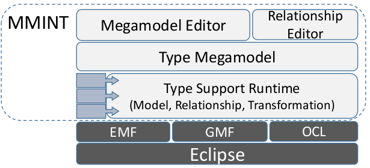

# MMINT 

**Model Management INTeractive (MMINT)** is an Eclipse-based workbench for graphical, interactive model management. MMINT allows modelers to do rapid prototyping and exploratory modeling while seamlessly keeping track of all relevant artifacts in their workspace. MMINT is developed by the Software Engineering group at the [University of Toronto](https://web.cs.toronto.edu), under the supervision of Professor [Marsha Chechik](http://www.cs.toronto.edu/~chechik).

**Model Management** is the management of collections of related models. It provides tools and techniques for dealing with large sets of models, defining relationships among models, manipulating models and relationships using operators (i.e., transformations). A special kind of model, generally called a **megamodel**, is used to represent such a scenario, with models as nodes and their relationships as arrows. Models and relationships are typically considered to be typed by their respective metamodels.

MMINT provides a graphical form of megamodel called a **Model Interconnection Diagram (MID)** as the interface through which to perform actions. In addition to the standard megamodel interactions already supported by existing interactive model management techniques, MMINT provides support for an additional layer, the **Type megamodel**, representing the collection of metamodels, relationships and transformations between them. The Type megamodel can be examined, modified and extended at runtime, allowing the user to have a dynamic type system and a reconfigurable workbench.

MMINT is used by the Software Engineering group as a common research platform and prototyping workbench, and it is rapidly evolving. Please be aware that the project's goal is not to become a production-level software, but to try and make our efforts available to the research community. As such, you will most certainly run into bugs.

## Installation

The easiest way of installing MMINT in Eclipse is using the [binary packages](#binary-packages), which will automatically take care of all the Eclipse dependencies. Alternatively, you can download and build the [source code](#source-code) from this git repository. Please take a look at the [requirements](#requirements) first to check that your system can run MMINT.

### Requirements

* Java 22
* [Eclipse Modeling Tools 2024-06](https://www.eclipse.org/downloads/packages/release/2024-06/r/eclipse-modeling-tools)
* After downloading Eclipse, open the `eclipse.ini` file and change the line below `-vm` to point to your Java 22 installation (for example, on Debian Linux change it to `/lib/jvm/java-22-openjdk-amd64/bin`, on Windows change it to `C:\Program Files\Java\jdk-22\bin`)

### Binary Packages

Binary packages for MMINT are created at each release and will automatically install the necessary Eclipse dependencies.

1. Add `https://adisandro.github.io/mmint/release` to the list of software sites in Eclipse (`Help > Install New Software > Available Software Sites`).
2. Install `Modeling > MMINT`.

You can also install [MMINT-A](#mmint-a) (a version of MMINT for automotive safety assurance), [MMINT-PL](#mmint-pl) (a version of MMINT for product lines), a selection of pre-packaged model types, relationship types and operators under the `Modelepedia` category, or examples from various papers under the `Examples` category.

Binary packages for the current development version of MMINT are similarly available using the software site `https://adisandro.github.io/mmint/develop`.

### Source code

Add the following update sites to Eclipse (`Help > Install New Software > Available Software Sites`):
  * `https://download.eclipse.org/tools/orbit/simrel/orbit-aggregation/2024-06`
  * `http://download.eclipse.org/modeling/emft/henshin/updates/release`
  * `https://static.incquerylabs.com/projects/massif/release/0.7.0/repository`

Then, install the following components (`Help > Install New Software`):
  * `Acceleo`
  * `ATL SDK - ATL Transformation Language SDK`
  * `Henshin SDK`
  * `M2E - Maven Integration for Eclipse`
  * `Massif Core`
  * `Papyrus for UML`
  * `Sirius Properties Views - Specifier Support`
  * `Sirius Specifier Environment`
  * `VIATRA Query and Transformation SDK`

To import the source code in your Eclipse workspace, use `File > Import` and then `Projects from Git` under the `Git` category. Wait until everything is built, then right-click on any project and `Run As > Eclipse Application`.

The projects are under the [plugins](plugins) directory: required projects under [Core](plugins/Core), projects that significantly extend functionality under [Core-Extensions](plugins/Core-Extensions), optional and domain specific projects under [Types](plugins/Types) and projects that deal with external tools under [External](plugins/External). The [features](features) directory contains the logical units of functionality, [tests](tests) contains a suite for regression testing, [releng](releng) contains the release engineering code, and [examples](examples) contains artifacts created with MMINT for various papers and conferences.

## Bundles

### MMINT-A

MMINT-A is an extended version of MMINT for automotive safety assurance, aimed to facilitate the creation, analysis, and evolution of safety models. MMINT-A adds the following features:

* Goal Structured Notation (GSN) assurance case editor.
* Safety goals decomposition using strategies that are provably deductive.
* Correctness checks for safety goals decompositions.
* Megamodel querying.
* Change impact assessment.

Follow these steps to install MMINT-A:

1. Add `https://adisandro.github.io/mmint/release` to the list of software sites in Eclipse (`Help > Install New Software > Available Software Sites`).
2. Install `Modeling > MMINT-A`.

### MMINT-PL

MMINT-PL is an extended version of MMINT for product lines, for creating and managing annotative product lines of models as well as to facilitate lifting modeling activities to the product line level. MMINT-PL adds the following features:

* Annotative Product Line (PL) editor for any EMF metamodel.
* PL well-formedness checks with respect to feature model and presence conditions.
* PL initialization from a product.
* Product instantiation by selection of features.
* PL-aware model relationships.
* Lifted VQL engine.

Follow these steps to install MMINT-PL:

1. Add `https://adisandro.github.io/mmint/release` to the list of software sites in Eclipse (`Help > Install New Software > Available Software Sites`).
2. Install `Modeling > MMINT-PL`.

## Publications

### About MMINT

*  [MMINT-A: A Framework for Model-Based Safety Assurance](https://doi.org/10.1016/j.scico.2023.103004)  
SciCo Vol. 231 | Install: `Examples > MMINT - SCICO23` | [Readme](examples/SCICO23/edu.toronto.cs.se.mmint.examples.scico23/SCICO23/README.md)
*  [Adding Product-Line Capabilities to Your Favourite Modeling Language](https://doi.org/10.1145/3571788.3571791)  
VaMoS 23 | Install: `Examples > MMINT - VAMOS23` | [Readme](examples/VAMOS23/edu.toronto.cs.se.mmint.examples.vamos23/VAMOS23/README.md)
* [MMINT-A 2.0: Tool Support for the Lifecycle of Model-Based Safety Artifacts](https://doi.org/10.1145/3417990.3422012)  
MoDELS 20 | Install: `Examples > MMINT - MoDELS20` | [Readme](examples/MoDELS20/edu.toronto.cs.se.mmint.example.models20/MoDELS20/README.md)
* [MMINT-A: A Tool for Automated Change Impact Assessment on Assurance Cases](https://doi.org/10.1007/978-3-319-99229-7_7)  
SAFECOMP 18
* [MU-MMINT: An IDE for Model Uncertainty](https://doi.org/10.1109/ICSE.2015.226)  
ICSE 15
* [MMINT: A Graphical Tool for Interactive Model Management](http://ceur-ws.org/Vol-1554/PD_MoDELS_2015_paper_6.pdf)  
MoDELS 15

### Using MMINT

*  PLACIDUS: Engineering Product Lines of Rigorous Assurance Cases  
iFM 24 (submitted) | Install: `Examples > MMINT - IFM24` | [Readme](examples/IFM24/edu.toronto.cs.se.mmint.examples.ifm24/IFM24/README.md)
*  [The ForeMoSt Approach to Building Valid Model-Based Safety Arguments](https://doi.org/10.1007/s10270-022-01063-4)  
SoSyM Vol. 22-5 | Install: `Examples > MMINT - SOSYM22` | [Readme](examples/SOSYM22/edu.toronto.cs.se.mmint.examples.sosym22/SOSYM22/README.md)
* [Validating Safety Arguments with Lean](https://doi.org/10.1007/978-3-030-92124-8_2)  
SEFM 21
* [A Lean Approach to Building Valid Model-Based Safety Arguments](https://doi.org/10.1109/MODELS50736.2021.00028)  
MODELS 21 | Install: `Examples > MMINT - MODELS21` | [Readme](examples/MODELS21/edu.toronto.cs.se.mmint.examples.models21/MODELS21/README.md)
* [Assurance Case Property Checking with MMINT-A and OCL](https://doi.org/10.1007/978-3-030-82083-1_30)  
CSER 20
* [Querying Automotive System Models and Safety Artifacts: Tool Support and Case Study](https://doi.org/10.2991/jase.d.200912.001)  
JASE Vol. 1-1 | Install: `Examples > MMINT - JASE20` | [Readme](examples/JASE20/edu.toronto.cs.se.mmint.example.jase20/JASE20/README.md)
* [Heterogeneous Megamodel Management using Collection Operators](https://doi.org/10.1007/s10270-019-00738-9)  
SoSyM Vol. 19-1 | Install: `Examples > SoSyM18` | [Readme](examples/SOSYM18/README.md)
* [Querying Automotive System Models and Safety Artifacts with MMINT and Viatra](https://doi.org/10.1109/MODELS-C.2019.00008)  
MASE@MoDELS 19 | Install: `Examples > MMINT - MASE19` | [Readme](examples/MASE19/edu.toronto.cs.se.mmint.example.mase19/MASE19/README.md)
* [Migrating Automotive Product Lines: A Case Study](https://doi.org/10.1007/978-3-319-21155-8_7)  
ICMT 15
* [Enriching megamodel management with collection-based operators](https://doi.org/10.1109/MODELS.2015.7338254)  
MoDELS 15
* [Lifting model transformations to product lines](https://doi.org/10.1145/2568225.2568267)  
ICSE 14
* [Supporting early decision-making in the presence of uncertainty](https://doi.org/10.1109/RE.2014.6912245)  
RE 14
* [Managing requirements uncertainty with partial models](https://doi.org/10.1007/s00766-013-0170-y)  
REJ Vol. 18-2
* [Transformation of Models Containing Uncertainty](https://doi.org/10.1007/978-3-642-41533-3_41)  
MoDELS 13

